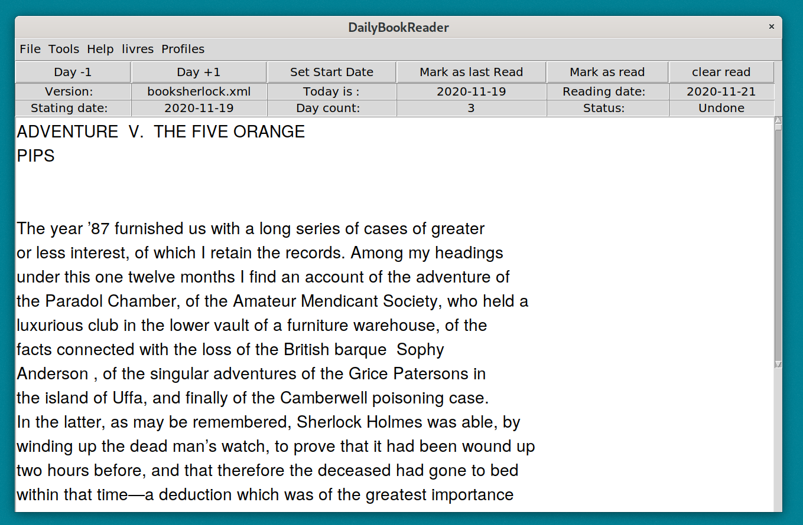

## Welcome to DailyBookReader 

Need to read an ebook by a  certain deadline?
This software allows the user to follow a proposed book
reading plan.

The first time the software is used, the software sets the beginnning
date to that date. But the user could change the
begining date. He could navigate backward of forward,
change version, while specifying which day he has read.
The status of a day says weither or not the text is read.

## Main tools

Python3 and Tkinter.

## More infomation

The book name has the format book*.xml. The plan name has the  format schedule*.xml.

A book has the following xml format (<c>  is a chapter and <p> is a paragraph)
```
<root>
<title> title text </title>
<c number="1">
<p>
A paragraph text
</p>
<p>
Another paragraph text
</p>
</c>
</root>
``` 

A plan has the following xml format (<d> is a day and <c> is a chapter)
```
<root>
<d number="1">
<c number="1"/>
</d>
</root>
```

##
As an example, we have included a schedule for reading in 7 days of "The Adventures of Sherlock Holmes", by Sir Arthur Conan Doyle.

## Screenshot
